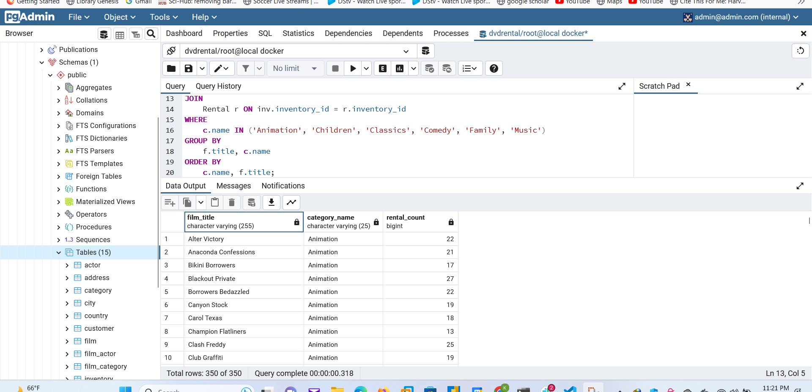
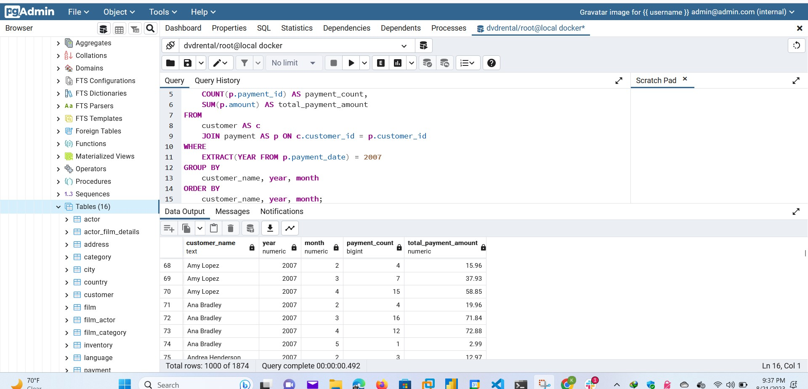

# Set Up Your Local Environment
What is PostgreSQL?
PostgreSQL is an object-relational database management system. Object-relational databases use a hybrid approach to databases.

In **object databases**, information is stored as objects, much like object-oriented programming.
In **relational databases**, information is stored in tables with relationships between tables defined by primary and foreign keys.
## There are two options for setting up PostgreSQL, you may opt for downloading or setting it up using Docker 
# Option 1:  Downloading PostgreSQL
First, you will need to install PostgreSQL on your local machine. Select the following three components during installation - PostgreSQL server, pgAdmin, and command-line tools. pgAdmin is a GUI tool for managing the database. Download the installer from the link below, and install with the admin privileges:

## Installing PostgreSQL for Windows:
https://www.postgresql.org/download/windows/ and follow the steps mentioned here


## Installing PostgreSQL for Mac OS:
https://www.postgresql.org/download/macosx/ and follow the steps mentioned here

Friendly reminder! Please write down the database superuser (postgres) password as you will need it to create the Sakila database once you have installed the PostgreSQL server.

Optionally, you can verify the successful installation of PostgreSQL using the following commands in your terminal:
```sql
# Server version:
pg_config --version
# Client version:
psql --version
```
# Option 2: Docker
Provided in this folder are docker configurations for setting up the dvdrental database on postgresql. a simple command `docker-compose up -d` will set up postgresql as well as pdgadmin as well as the database `dvdrental`

Step 2. Downloading Sakila database
Once PostgreSQL server is installed, you will need to download the Movie database from this page: PostgreSQL Sample Database

Scroll down and click on the orange "Download DVD Rental Sample Database" button.

This will download a zipped file, and you will need to extract the dvdrental.tar file.


# **Step 3. Connect to the PostgreSQL server**
Launch pgAdmin tool, a graphical tool for managing and developing PostgreSQL databases. The PostgreSQL interactive installer by EDB includes the pgAdmin by default. If you have a native PostgreSQL installation, you can download pgAdmin from here. It will take some time to launch the pgAdmin tool. Let's connect the pgAdmin to the PostgreSQL server.
For the option using `docker `, you will lounch pgAdmin through localhost:8081, as in my case and connect the server following the steps below: 

Within the Object browser (left-navigation pane), right-click on the Servers → Create → Server... option.

Connect to a PostgreSQL server

* It will open up a dialog box asking for the PostgreSQL server name, and credentials for the “postgres" superuser. Se


Provide server details

Provide the following details, and leave the other fields as default.
| Tab     Field      | Value        |
|------------------------|--------------|
| General Name       | PostgreSQL   |

then in the next table called connection: 


| Connection | Host name  | Post         | Username   | Password   |
|------------|------------|--------------|------------|------------|
|            | localhost  | 5432 (default) | `postgres` | `root`     |


All steps are also mentioned here - [connect to the PostgreSQL server](https://www.postgresqltutorial.com/connect-to-postgresql-database/).

# **Step 4. Loading database**
The next step is to load the DVD Rental database into your PostgreSQL server on your machine. Follow the instructions on the page - Load PostgreSQL Sample Database (scroll down ⅓ on this page). There are two ways to load the database:

Load the sample database using psql tool

Load the DVD Rental database using the pgAdmin

We will use the Load the DVD Rental database using pgAdmin tool method. 

The general steps to load the sample database into your local PostgreSQL database server are:

**Create a blank database, with the name dvdrental.**

**Restore the data from the locally downloaded Sakila database.**

**Restore the database**

You need to have either the unzipped data folder or the tar format file locally. Choose the desired source format and the path of the file/folder.

**Provide source format and path**

# **Step 5. Choose the DVD Rental database**
Once, you have restored the database, you are all set to use it. Choose the dvdrental database under Databases (left-navigation pane).

**Choose the database**

Step 6. Running Queries on your dvdrental database
Ready to run some queries??
Open the Query tool, write your queries in the Query editor, and run them to see your data output. See the snapshots below.


# Composite Key
You are familiar with primary and foreign keys in Entity Relationship Diagrams (ERDs). We will introduce a new type of key - a Composite Key - as part of the DVD Rental Database project.

Please have a copy of the ERD handy. It is available at the bottom of the page as a resource as well.

A table with a Composite Key does not have a unique key for each row in the table. Instead a combination of two or more columns serves as a unique identifier for each row.

You can read more about Composite Keys in the following link:

https://www.javatpoint.com/sql-composite-key

Here is an example from the DVD Rental Database. You can see below some sample rows from the film_actor table. We have provided two table headers, the first where the rows are sorted by film_id, and the second where the rows are sorted by actor_id.

Comparing the two table headers, you can see just using 1 column, e.g., the actor_id column, does not uniquely identify the relationship between the film and actor. Similarly, using just the film_id column does not uniquely identify the relationship. The combination of actor_id with film_id creates a combined (or composite) unique value for each row in the table. The combination of the two column values (actor_id = 1 and film_id = 1) identify the entity relationship.
you can as well check for tables with composite key using the following query: 
```slq
SELECT tc.table_name, string_agg(kcu.column_name, ', ') AS composite_key_columns
FROM information_schema.table_constraints AS tc
JOIN information_schema.key_column_usage AS kcu
  ON tc.constraint_name = kcu.constraint_name
  AND tc.table_schema = kcu.table_schema
WHERE tc.constraint_type = 'PRIMARY KEY'
GROUP BY tc.table_name
HAVING count(*) > 1;
```
This query retrieves tables with composite keys by looking at the primary key constraints in the database. It uses the `information_schema `views to join the `table_constraints` and `key_column_usage` views and filters for primary key constraints with multiple columns (count greater than 1). The result will show the names of tables along with the columns that make up the composite key.

Please note that the HAVING count(*) > 1 condition is used to specifically retrieve tables with composite keys (more than one column in the primary key).

Run this query in your PostgreSQL database to get the list of tables with composite keys.

The results shows that two tables, film actor and film_category are the tables with composite keys. 


# Start Querying Your Data
The database Entity Relationship Diagram was provided at the start of this lesson, but you can also download it below. Now you can start querying your database!

First, we could have a look at all the data from the Film table:
```sql
SELECT * FROM Film;
```


Now check out what's in the Actor table.
```sql
SELECT * FROM Actor;
```

Looks like you are ready to take on this PROJECT! Everything you have been studying is going to come in handy now!

A quick note: You can ignore the "last_update" column in the tables, as that column is part of the Sakila database but we will not be using it.

Note: If the proper tables for the DVD Rental Database do not appear for some reason in the Schema below, you can fix this using the Menu in the lower left of the workspace. Make sure you have first saved any query you have entered, then click on Menu, then choose Reset Data, and type in "Reset Data" as directed. This will definitely bring up the proper schema tables for the DVD Rental Database.

# Understanding the database
### Which of these columns are in the RENTAL table?
```sql
SELECT column_name
FROM information_schema.columns
WHERE table_name = 'rental'
ORDER BY ordinal_position;
```


### How many foreign keys exist in each of the following tables?

To find out how many foreign keys exist in each of the tables, you can use the following SQL query:
```sql
SELECT tc.table_name, COUNT(kcu.column_name) AS num_foreign_keys
FROM information_schema.table_constraints AS tc
JOIN information_schema.key_column_usage AS kcu
  ON tc.constraint_name = kcu.constraint_name
  AND tc.table_schema = kcu.table_schema
WHERE tc.constraint_type = 'FOREIGN KEY'
GROUP BY tc.table_name
ORDER BY num_foreign_keys DESC;
```


# Practice Quiz #1

## Quiz Question

Let's start with creating a table that provides the following details: actor's first and last name combined as full_name, film title, film description and length of the movie.

How many rows are there in the table?
below is the query that gives the answer to the quiz above: 
```sql
-- Create a table with the specified details
CREATE TABLE actor_film_details AS
SELECT
    CONCAT(a.first_name, ' ', a.last_name) AS full_name,
    f.title,
    f.description,
    f.length
FROM
    actor a
JOIN
    film_actor fa ON a.actor_id = fa.actor_id
JOIN
    film f ON fa.film_id = f.film_id;

-- Count the number of rows in the table
SELECT COUNT(*) FROM actor_film_details;
```


### Quiz Question

Write a query that creates a list of actors and movies where the movie length was more than 60 minutes. How many rows are there in this query result?
below is the query that gives you the answer to the quiz above: 

```sql
-- Create a list of actors and movies where the movie length was more than 60 minutes
SELECT
    CONCAT(a.first_name, ' ', a.last_name) AS actor_name,
    f.title AS movie_title,
    f.length AS movie_length
FROM
    actor a
JOIN
    film_actor fa ON a.actor_id = fa.actor_id
JOIN
    film f ON fa.film_id = f.film_id
WHERE
    f.length > 60;

-- Count the number of rows in the query result
SELECT COUNT(*) FROM (
    SELECT
        CONCAT(a.first_name, ' ', a.last_name) AS actor_name,
        f.title AS movie_title,
        f.length AS movie_length
    FROM
        actor a
    JOIN
        film_actor fa ON a.actor_id = fa.actor_id
    JOIN
        film f ON fa.film_id = f.film_id
    WHERE
        f.length > 60
) AS query_result;
```


Question 3: Write a query that captures the full name of the actor, and counts the number of movies each actor has made. Identify the actor who has made the maximum number of movies. below is my answer to the query: 
```sql
SELECT
    a.actor_id,
    CONCAT(a.first_name, ' ', a.last_name) AS full_name,
    COUNT(fa.film_id) AS number_of_movies
FROM
    actor a
LEFT JOIN
    film_actor fa ON a.actor_id = fa.actor_id
GROUP BY
    a.actor_id, full_name
ORDER BY
    number_of_movies DESC
LIMIT 1;
```
# <u>Here are the answers given to the questions in the classroom: </u>

## Practice Solution #1
Here are my solutions for Practice Quiz 1 questions:
```sql
-- Question 1: Query that creates a table with the following details: actor's first and last name combined as full_name, film title and length of the movies.

SELECT a.first_name, 
       a.last_name,
       a.first_name || ' ' || a.last_name AS full_name,
       f.title,
       f.length
FROM   film_actor fa
JOIN   actor a
ON     fa.actor_id = a.actor_id
JOIN   film f
ON     f.film_id = fa.film_id```
-- Question 2: Write a query that creates a list of actors and movies where the movie length was more than 60 minutes.

SELECT a.first_name, 
       a.last_name,
       a.first_name || ' ' || a.last_name AS full_name,
       f.title ,
       f.length
FROM   film_actor fa
JOIN   actor a
ON     fa.actor_id = a.actor_id
JOIN   film f
ON     f.film_id = fa.film_id
WHERE  f.length > 60```
-- Question 3: Write a query that captures the full name of the actor, and counts the number of movies each actor has made. Identify the actor who has made the maximum number of movies.

SELECT actorid, full_name, 
       COUNT(filmtitle) film_count_peractor
FROM
    (SELECT a.actor_id actorid,
	        a.first_name, 
            a.last_name,
            a.first_name || ' ' || a.last_name AS full_name,
            f.title filmtitle
    FROM    film_actor fa
    JOIN    actor a
    ON      fa.actor_id = a.actor_id
    JOIN    film f
    ON      f.film_id = fa.film_id) t1
GROUP BY 1, 2
ORDER BY 3 DESC```
```

# <u> Practice Quiz #2 </u>

### Quiz Question
Write a query that displays a table with 4 columns: actor's full name, film title, length of movie, and a column name "filmlen_groups" that classifies movies based on their length. Filmlen_groups should include 4 categories: 1 hour or less, Between 1-2 hours, Between 2-3 hours, More than 3 hours.

Match the filmlen_groups with the movie titles in your result dataset.
Here is a query to match the filmlen_groups with the movie titles: 
```sql
SELECT 
    CONCAT(a.first_name, ' ', a.last_name) AS full_name,
    f.title,
    f.length,
    CASE
        WHEN f.length <= 60 THEN '1 hour or less'
        WHEN f.length > 60 AND f.length <= 120 THEN 'Between 1-2 hours'
        WHEN f.length > 120 AND f.length <= 180 THEN 'Between 2-3 hours'
        ELSE 'More than 3 hours'
    END AS filmlen_groups
FROM
    actor AS a
JOIN
    film_actor AS fa ON a.actor_id = fa.actor_id
JOIN
    film AS f ON fa.film_id = f.film_id;
```
This query retrieves data from the actor, film_actor, and film tables, calculates the filmlen_groups based on the movie length, and displays the results with actor's full name, film title, movie length, and the corresponding filmlen_groups category.
To make it easy to answer the question in class which requires 3 film titles, namely, Academy Dinosaur, Color Philadelphia, and Oklahoma Jumanji, we shall filter the result of the dataset using `WHERE`. Here is the query: 
```sql
SELECT 
    CONCAT(a.first_name, ' ', a.last_name) AS full_name,
    f.title,
    f.length,
    CASE
        WHEN f.length <= 60 THEN '1 hour or less'
        WHEN f.length > 60 AND f.length <= 120 THEN 'Between 1-2 hours'
        WHEN f.length > 120 AND f.length <= 180 THEN 'Between 2-3 hours'
        ELSE 'More than 3 hours'
    END AS filmlen_groups
FROM
    actor AS a
JOIN
    film_actor AS fa ON a.actor_id = fa.actor_id
JOIN
    film AS f ON fa.film_id = f.film_id
WHERE
    f.title IN ('Academy Dinosaur', 'Color Philadelphia', 'Oklahoma Jumanji');
```
 

we might wanna use groupby so that our table is simple and straight to the answer: 
```sql
SELECT 
    f.title,
    CASE
        WHEN f.length <= 60 THEN '1 hour or less'
        WHEN f.length > 60 AND f.length <= 120 THEN 'Between 1-2 hours'
        WHEN f.length > 120 AND f.length <= 180 THEN 'Between 2-3 hours'
        ELSE 'More than 3 hours'
    END AS filmlen_groups
FROM
    film AS f
WHERE
    f.title IN ('Academy Dinosaur', 'Color Philadelphia', 'Oklahoma Jumanji')
GROUP BY
    f.title, filmlen_groups;
```


### Quiz Question
Now, we bring in the advanced SQL query concepts! Revise the query you wrote above to create a count of movies in each of the 4 filmlen_groups: 1 hour or less, Between 1-2 hours, Between 2-3 hours, More than 3 hours.

Match the count of movies in each filmlen_group. Here is the query that matches the count of movies in each filmlen_group: 

```sql
SELECT 
    CASE
        WHEN length <= 60 THEN '1 hour or less'
        WHEN length > 60 AND length <= 120 THEN 'Between 1-2 hours'
        WHEN length > 120 AND length <= 180 THEN 'Between 2-3 hours'
        ELSE 'More than 3 hours'
    END AS filmlen_groups,
    COUNT(*) AS movie_count
FROM
    film
GROUP BY
    filmlen_groups;
```


Here are the answers given in class. They may or may not look like the onces i researched above. 

# Practice Solution #2
Here are my solutions for Practice Quiz 2 questions:
```sql
-- Question 1: Write a query that creates a table with 4 columns: actor's full name, film title, length of movie, and a column name "filmlen_groups" that classifies movies based on their length. Filmlen_groups should include 4 categories: 1 hour or less, Between 1-2 hours, Between 2-3 hours, More than 3 hours.

SELECT full_name, 
       filmtitle,
       filmlen,
       CASE WHEN filmlen <= 60 THEN '1 hour or less'
       WHEN filmlen > 60 AND filmlen <= 120 THEN 'Between 1-2 hours'
       WHEN filmlen > 120 AND filmlen <= 180 THEN 'Between 2-3 hours'
       ELSE 'More than 3 hours' END AS filmlen_groups
FROM 
	(SELECT a.first_name, 
		       a.last_name,
		       a.first_name || ' ' || a.last_name AS full_name,
		       f.title filmtitle, 
		       f.length filmlen
		FROM film_actor fa
		JOIN actor a
		ON fa.actor_id = a.actor_id
		JOIN film f
		ON f.film_id = fa.film_id) t1
-- Question 2: Write a query you to create a count of movies in each of the 4 filmlen_groups: 1 hour or less, Between 1-2 hours, Between 2-3 hours, More than 3 hours.


SELECT    DISTINCT(filmlen_groups),
          COUNT(title) OVER (PARTITION BY filmlen_groups) AS filmcount_bylencat
FROM  
         (SELECT title,length,
      	CASE WHEN length <= 60 THEN '1 hour or less'
      	WHEN length > 60 AND length <= 120 THEN 'Between 1-2 hours'
      	WHEN length > 120 AND length <= 180 THEN 'Between 2-3 hours'
      	ELSE 'More than 3 hours' END AS filmlen_groups
          FROM film ) t1
ORDER BY  filmlen_groups
```
The last answer is specifically intriguing. Here are few takeaways i picked after examining the answer, which reminds me of the First part of the course where we delved into Window functions: 
# **Window Functions with PARTITION BY:** 
```sql
SELECT DISTINCT(filmlen_groups),
       COUNT(title) OVER (PARTITION BY filmlen_groups) AS filmcount_bylencat
FROM (
    SELECT title, length,
           CASE
               WHEN length <= 60 THEN '1 hour or less'
               WHEN length > 60 AND length <= 120 THEN 'Between 1-2 hours'
               WHEN length > 120 AND length <= 180 THEN 'Between 2-3 hours'
               ELSE 'More than 3 hours'
           END AS filmlen_groups
    FROM film
) t1
ORDER BY filmlen_groups;
```
In this query:

The inner subquery calculates the filmlen_groups column based on the length of the film, similar to the previous query.
The outer query then uses the DISTINCT keyword to retrieve unique values of filmlen_groups.
The window function COUNT(title) OVER (PARTITION BY filmlen_groups) calculates the count of movies for each filmlen_groups, but this count is repeated for each row with the same filmlen_groups value due to the PARTITION BY clause.

# **GROUP BY with COUNT:**
```sql
SELECT filmlen_groups,
       COUNT(title) AS filmcount_bylencat
FROM (
    SELECT title, length,
           CASE
               WHEN length <= 60 THEN '1 hour or less'
               WHEN length > 60 AND length <= 120 THEN 'Between 1-2 hours'
               WHEN length > 120 AND length <= 180 THEN 'Between 2-3 hours'
               ELSE 'More than 3 hours'
           END AS filmlen_groups
    FROM film
) t1
GROUP BY filmlen_groups
ORDER BY filmlen_groups;
```

In this query:

The inner subquery calculates the filmlen_groups column based on the length of the film, similar to the previous query.
The outer query then uses the DISTINCT keyword to retrieve unique values of filmlen_groups.
The window function COUNT(title) OVER (PARTITION BY filmlen_groups) calculates the count of movies for each filmlen_groups, but this count is repeated for each row with the same filmlen_groups value due to the PARTITION BY clause.

## **GROUP BY with COUNT:**
```sql

SELECT filmlen_groups,
       COUNT(title) AS filmcount_bylencat
FROM (
    SELECT title, length,
           CASE
               WHEN length <= 60 THEN '1 hour or less'
               WHEN length > 60 AND length <= 120 THEN 'Between 1-2 hours'
               WHEN length > 120 AND length <= 180 THEN 'Between 2-3 hours'
               ELSE 'More than 3 hours'
           END AS filmlen_groups
    FROM film
) t1
GROUP BY filmlen_groups
ORDER BY filmlen_groups;
```
In the previous query I provided:

- The inner subquery calculates the filmlen_groups column using the same logic.
- The outer query uses the GROUP BY clause to group the results by filmlen_groups.
- The COUNT(title) function directly counts the number of movies for each filmlen_groups group.

## **Key Differences:**

- The window function approach allows you to include the calculated count for each row in the result set without the need for a separate grouping.
- The GROUP BY approach provides a clear structure for aggregation, where you group the results and apply aggregation functions directly on each group.
- Both approaches produce similar results, but the window function approach can be useful when you want to combine individual row data with aggregated data without a strict grouping structure.
## **What to Learn:**
Understanding both approaches can help you:

- Learn about window functions and their usage in SQL.
- Understand how PARTITION BY works with window functions to perform calculations over specific groups of rows.
- Recognize the flexibility of SQL syntax and how different approaches can achieve similar results.
- Decide which approach to use based on your specific use case, readability, and maintainability of your queries.
# **Question Sets**
## From class
*We have also provided a set of questions that you are free to consider and include in your Project Submission. These are solely provided for your convenience, and you can choose to use any of the questions in these sets or none at all in your project submission.*

*If you are unsure what queries to generate (for e.g., what kind of query will require the use of Window Functions), we strongly recommend using questions from the question set.*

# Question 1
We want to understand more about the movies that families are watching. The following categories are considered family movies: Animation, Children, Classics, Comedy, Family and Music.

Create a query that lists each movie, the film category it is classified in, and the number of times it has been rented out.

Check Your Solution
For this query, you will need 5 tables: Category, Film_Category, Inventory, Rental and Film. Your solution should have three columns: Film title, Category name and Count of Rentals.

The following table header provides a preview of what the resulting table should look like if you order by category name followed by the film title.

HINT: One way to solve this is to create a count of movies using aggregations, subqueries and Window functions.

his practice question involves joining multiple tables and performing aggregations to retrieve information about family movies and their rental counts. Let's break down the solution step by step:

We want to find family movies, so we need to identify the category IDs corresponding to family-related categories: Animation, Children, Classics, Comedy, Family, and Music.

Join the relevant tables to gather the required information:

- Join the Category and Film_Category tables on their common category_id.
- Join the Film and Inventory tables on their common film_id.
- Join the Inventory and Rental tables on their common inventory_id.
- Use a CASE statement to check if the movie belongs to a family-related category. This will allow us to classify movies as family or non-family.

- Aggregate the data by movie title, category name, and count the number of rentals for each movie.

- Order the results by category name and then by film title.

Here's the SQL query that accomplishes these steps:
```sql
SELECT
    f.title AS film_title,
    c.name AS category_name,
    COUNT(r.rental_id) AS rental_count
FROM
    Category c
JOIN
    Film_Category fc ON c.category_id = fc.category_id
JOIN
    Film f ON fc.film_id = f.film_id
JOIN
    Inventory inv ON f.film_id = inv.film_id
JOIN
    Rental r ON inv.inventory_id = r.inventory_id
WHERE
    c.name IN ('Animation', 'Children', 'Classics', 'Comedy', 'Family', 'Music')
GROUP BY
    f.title, c.name
ORDER BY
    c.name, f.title;
```


# Question 2
Now we need to know how the length of rental duration of these family-friendly movies compares to the duration that all movies are rented for. Can you provide a table with the movie titles and divide them into 4 levels (first_quarter, second_quarter, third_quarter, and final_quarter) based on the quartiles (25%, 50%, 75%) of the average rental duration(in the number of days) for movies across all categories? Make sure to also indicate the category that these family-friendly movies fall into.

**Check Your Solution**

The data are not very spread out to create a very fun looking solution, but you should see something like the following if you correctly split your data. You should only need the category, film_category, and film tables to answer this and the next questions. 

*HINT: One way to solve it requires the use of percentiles, Window functions, subqueries or temporary tables.*

To solve this question, we need to calculate the quartiles of the average rental duration for movies across all categories and then categorize the family-friendly movies into four levels based on these quartiles. We will need to use the film, film_category, and category tables.

**Here's how you can approach it:**

Calculate the quartiles of the average rental duration across all movies.
Identify the category that each family-friendly movie belongs to.
Categorize the family-friendly movies into four levels based on the quartiles.

**Here's the SQL query to achieve this:**
```sql
WITH AverageRentalDuration AS (
    SELECT
        AVG(rental_duration) AS avg_rental_duration
    FROM
        film
)
SELECT
    f.title,
    c.name AS category_name,
    CASE
        WHEN f.rental_duration <= (SELECT PERCENTILE_CONT(0.25) WITHIN GROUP (ORDER BY avg_rental_duration) FROM AverageRentalDuration) THEN 'first_quarter'
        WHEN f.rental_duration <= (SELECT PERCENTILE_CONT(0.50) WITHIN GROUP (ORDER BY avg_rental_duration) FROM AverageRentalDuration) THEN 'second_quarter'
        WHEN f.rental_duration <= (SELECT PERCENTILE_CONT(0.75) WITHIN GROUP (ORDER BY avg_rental_duration) FROM AverageRentalDuration) THEN 'third_quarter'
        ELSE 'final_quarter'
    END AS rental_duration_level
FROM
    film AS f
    JOIN film_category AS fc ON f.film_id = fc.film_id
    JOIN category AS c ON fc.category_id = c.category_id
WHERE
    c.name IN ('Animation', 'Children', 'Classics', 'Comedy', 'Family', 'Music')
ORDER BY
    c.name, f.title;
```
**Explanation:**

- We calculate the average rental duration across all movies using a common table expression (CTE) named AverageRentalDuration.
- The main query joins the film, film_category, and category tables to gather the necessary data.
- Using a CASE statement, we categorize each movie into one of the four levels based on the quartiles of the average rental duration.
- We filter the movies to include only those belonging to family-friendly categories.
- Finally, we order the results by category name and film title.

Keep in mind that the solution might vary depending on the SQL database system you are using and its specific syntax for window functions and percentiles. The above query provides a general idea of how to approach the problem.

# Question 3
Finally, provide a table with the family-friendly film category, each of the quartiles, and the corresponding count of movies within each combination of film category for each corresponding rental duration category. The resulting table should have three columns:

- Category
- Rental length category
- Count

**Check Your Solution**

The following table header provides a preview of what your table should look like. The Count column should be sorted first by Category and then by Rental Duration category.

*HINT: One way to solve this question requires the use of Percentiles, Window functions and Case statements.*

```sql
WITH AverageRentalDuration AS (
    SELECT
        c.name AS category_name,
        PERCENTILE_CONT(0.25) WITHIN GROUP (ORDER BY f.rental_duration) AS first_quarter,
        PERCENTILE_CONT(0.50) WITHIN GROUP (ORDER BY f.rental_duration) AS second_quarter,
        PERCENTILE_CONT(0.75) WITHIN GROUP (ORDER BY f.rental_duration) AS third_quarter
    FROM
        film AS f
        JOIN film_category AS fc ON f.film_id = fc.film_id
        JOIN category AS c ON fc.category_id = c.category_id
    WHERE
        c.name IN ('Animation', 'Children', 'Classics', 'Comedy', 'Family', 'Music')
    GROUP BY
        c.name
),
FamilyFriendlyMovies AS (
    SELECT
        f.film_id,
        f.rental_duration,
        c.name AS category_name
    FROM
        film AS f
        JOIN film_category AS fc ON f.film_id = fc.film_id
        JOIN category AS c ON fc.category_id = c.category_id
    WHERE
        c.name IN ('Animation', 'Children', 'Classics', 'Comedy', 'Family', 'Music')
)
SELECT
    a.category_name,
    f.rental_duration,
    CASE
        WHEN f.rental_duration <= a.first_quarter THEN 'first_quarter'
        WHEN f.rental_duration <= a.second_quarter THEN 'second_quarter'
        WHEN f.rental_duration <= a.third_quarter THEN 'third_quarter'
        ELSE 'final_quarter'
    END AS rental_duration_category,
    COUNT(*) AS count
FROM
    FamilyFriendlyMovies AS f
    JOIN AverageRentalDuration AS a ON f.category_name = a.category_name
GROUP BY
    a.category_name, rental_duration_category, f.rental_duration
ORDER BY
    a.category_name, rental_duration_category, f.rental_duration;

```
**Explanation:**

- In the CTE AverageRentalDuration, we calculate the quartiles of the rental duration within each family-friendly category.
- The CTE FamilyFriendlyMovies selects the film_id, rental_duration, and category_name for family-friendly movies.
- In the main query, we join the FamilyFriendlyMovies and AverageRentalDuration CTEs.
- We use the calculated quartile values from the AverageRentalDuration CTE to categorize the movies based on the rental duration.
- The COUNT(*) function is used to count the number of movies in each combination of category, rental duration, and rental duration category.
- The results are ordered by category name, rental duration category, and rental duration.


# **Question Set 2**
The questions in this question set use the more advanced techniques of the course. These are meant to help you practice some of these more advanced techniques. Again, you have the choice to use any of these questions or use your own. Remember, you need only to submit queries that meet the criteria as specified in the Rubric.

## **Question 1:**
We want to find out how the two stores compare in their count of rental orders during every month for all the years we have data for. Write a query that returns the store ID for the store, the year and month and the number of rental orders each store has fulfilled for that month. Your table should include a column for each of the following: year, month, store ID and count of rental orders fulfilled during that month.

Check Your Solution
The following table header provides a preview of what your table should look like. The count of rental orders is sorted in descending order.

*HINT: One way to solve this query is the use of aggregations.*
Here is a query to arrive at the table given:
```sql
SELECT
    EXTRACT(YEAR FROM r.rental_date) AS year,
    EXTRACT(MONTH FROM r.rental_date) AS month,
    i.store_id,
    COUNT(r.rental_id) AS rental_orders_count
FROM
    rental AS r
    JOIN inventory AS i ON r.inventory_id = i.inventory_id
GROUP BY
    year, month, i.store_id
ORDER BY
    rental_orders_count DESC, year, month, i.store_id;
```


**Explanation:**

- We join the rental and inventory tables using the common column inventory_id to retrieve information about the rental orders and the corresponding store.
- We use the EXTRACT function to extract the year and month from the rental_date column.
- The GROUP BY clause groups the results by year, month, and store_id.
- The COUNT function calculates the number of rental orders fulfilled by each store for each month and year.
- The results are ordered in descending order of rental orders count, and then by year, month, and store ID.

Please note that the solution might need adjustments based on the specific SQL database system you are using.

# **Question 2**
We would like to know who were our top 10 paying customers, how many payments they made on a monthly basis during 2007, and what was the amount of the monthly payments. Can you write a query to capture the customer name, month and year of payment, and total payment amount for each month by these top 10 paying customers?

Check your Solution:
The following table header provides a preview of what your table should look like. The results are sorted first by customer name and then for each month. As you can see, total amounts per month are listed for each customer.

*HINT: One way to solve is to use a subquery, limit within the subquery, and use concatenation to generate the customer name.*

Here is a query to arrive at the solution: 
```sql
SELECT
    CONCAT(c.first_name, ' ', c.last_name) AS customer_name,
    EXTRACT(YEAR FROM p.payment_date) AS year,
    EXTRACT(MONTH FROM p.payment_date) AS month,
    COUNT(p.payment_id) AS payment_count,
    SUM(p.amount) AS total_payment_amount
FROM
    customer AS c
    JOIN payment AS p ON c.customer_id = p.customer_id
WHERE
    EXTRACT(YEAR FROM p.payment_date) = 2007
GROUP BY
    customer_name, year, month
ORDER BY
    customer_name, year, month;
```
**Explanation:**

- First, We join the customer and payment tables using the common column `customer_id` to retrieve information about customers and their payments.

- We use the `CONCAT` function to concatenate the `first_name` and `last_name` columns to create the customer's full name.
- The `EXTRACT` function is used to extract the year and month from the `payment_date` column.
- The `WHERE` clause filters the results to only include payments made in the year 2007.
- The `GROUP BY` clause groups the results by customer name, year, and month.

- The `COUNT` function calculates the number of payments made by each customer in each month.
- The `SUM` function calculates the total payment amount made by each customer in each month.
The results are ordered first by customer name, then by year, and finally by month.



# **Question 3**
Finally, for each of these top 10 paying customers, I would like to find out the difference across their monthly payments during 2007. Please go ahead and write a query to compare the payment amounts in each successive month. Repeat this for each of these 10 paying customers. Also, it will be tremendously helpful if you can identify the customer name who paid the most difference in terms of payments.

Check your solution:
The customer Eleanor Hunt paid the maximum difference of $64.87 during March 2007 from $22.95 in February of 2007.

*HINT: You can build on the previous questions query to add Window functions and aggregations to get the solution.*

Here is a query that achieves the solution for the task above: 

```sql
WITH TopPayingCustomers AS (
    SELECT
        c.customer_id,
        CONCAT(c.first_name, ' ', c.last_name) AS customer_name,
        EXTRACT(YEAR FROM p.payment_date) AS year,
        EXTRACT(MONTH FROM p.payment_date) AS month,
        SUM(p.amount) AS total_payment_amount
    FROM
        customer AS c
        JOIN payment AS p ON c.customer_id = p.customer_id
    WHERE
        EXTRACT(YEAR FROM p.payment_date) = 2007
    GROUP BY
        c.customer_id, customer_name, year, month
),
DifferenceCalculation AS (
    SELECT
        customer_id,
        customer_name,
        year,
        month,
        total_payment_amount,
        LAG(total_payment_amount) OVER (PARTITION BY customer_id ORDER BY year, month) AS previous_month_amount
    FROM
        TopPayingCustomers
)
SELECT
    customer_name,
    TO_CHAR(TO_DATE(month::text, 'MM'), 'Month') AS month_name,
    year,
    total_payment_amount - previous_month_amount AS difference
FROM
    DifferenceCalculation
WHERE
    previous_month_amount IS NOT NULL
ORDER BY
    difference DESC
LIMIT 1;
```
Seems I go the answer which is wrong from the given in hint and check solution: 

